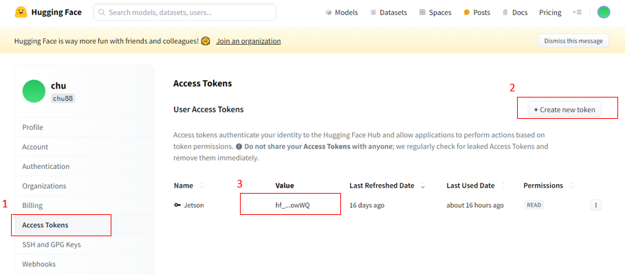
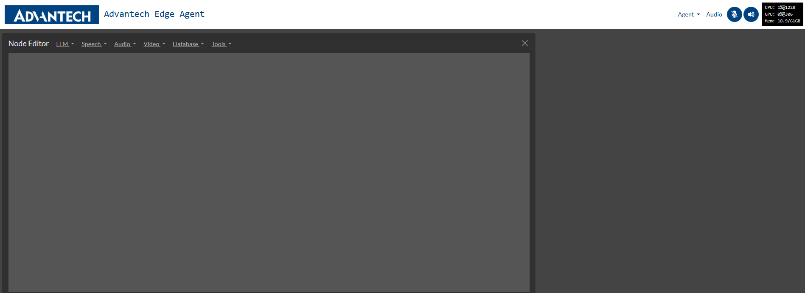

# Advantech Edge Agent

Advantech Edge Agent is an interactive sandbox designed to facilitate the rapid design and experimentation of automation agents, personal assistants, and edge AI systems. It seamlessly integrates multimodal Large Language Models (LLMs), speech and vision transformers, vector databases, prompt templates, and function calling with live sensors and I/O. Optimized for deployment on Jetson devices, it offers on-device computing, low-latency streaming, and unified memory for enhanced performance.

<a href="https://www.youtube.com/watch?v=xsvGXlDslf0"></a>

> 💡Advantech Edge Agent is built on Agent Studio from Jetson AI Lab, enhanced with additional custom features. Users may find the [official tutorial](https://www.jetson-ai-lab.com/tutorial-intro.html), the [Jetson Forums](https://forums.developer.nvidia.com/c/agx-autonomous-machines/jetson-embedded-systems/jetson-projects/78) and [GitHub Issues](https://github.com/dusty-nv/NanoLLM) from NVIDIA helpful.

## Features

- **Interactive Environment**: Design and test automation agents and personal assistants in a user-friendly interface.
- **Multimodal Integration**: Combine LLMs with speech and vision transformers for comprehensive AI solutions.
- **Real-Time Sensor Integration**: Connect and interact with live sensors and I/O for real-world applications.
- **Optimized for Jetson Devices**: Leverage on-device computing and low-latency streaming for enhanced performance.

> 💡Learn more about [Practical Examples](https://github.com/advantech-EdgeAI/edge_agent/wiki#practical-examples) of using Edge Agent in wiki.

# Edge Agent Installation 

## System Requirements

| Name            | Description                                           |
|-----------------|-------------------------------------------------------|
| Product         | MIC-733-AO5A1 (32GB) / MIC-733-AO6A1 (64GB)           |
| JetPack Version | V6.0GA                                                |
| Storage         | 512GB NVMe SSD (recommended)                          |
| USB Camera      | Logitech c270 HD webcam or any V4L2 compatible camera |
| Internet        | Required during installation                          |

## 1. Docker Service Installation 
> 💡 From JetPack 6, SDK Manager does not install docker service by default.

### Checking on Docker Service
Check the version of docker to ensure your system has docker service installed properly.
```
docker --version
```

### If docker is not available, run following script to enable it on your JP 6 device.

```
bash init-dockerd-jetson-jp6.sh
```

##  2. (Optional) Setup Extended Storage - NVMe SSD
> 💡💡💡 
>
> **If your rootfs(/) has free storage > 60GB, you could skip this step and jump to "Download Essential Data" Section.**

### Physical installation
1. Power off your Jetson device and disconnect peripherals.
2. Insert the NVMe SSD into the carrier board, ensuring it's properly seated and secured.
3. Reconnect peripherals and power on the device.
4. Verify the SSD is recognized by running:
   ```
   lspci
   ```
   You should see an entry similar to:
   ```
   0007:01:00.0 Non-Volatile memory controller: Marvell Technology Group Ltd. Device 1322 (rev 02)
   ```

### Make ext4 FS on SSD and Mount it on /ssd by default
 - Find the "Format and set up auto-mount" Section in [Link](https://www.jetson-ai-lab.com/tips_ssd-docker.html)

### Migrate Docker Directory SSD
 - Find the "Migrate Docker Directory SSD" Section in [Link](https://www.jetson-ai-lab.com/tips_ssd-docker.html)

>  At this stage, you have installed Docker and an SSD on your device and set the SSD as the default storage location for Docker images.

### ☕ Verifying new installed SSD

 You can follow these optional steps to verify that the SSD is configured correctly for Docker images and disable Apport reporting:

- [Test Docker on SSD](https://github.com/advantech-EdgeAI/edge_agent/wiki/Test-Docker-on-SSD)
- [Disable Apport Reporting](https://github.com/advantech-EdgeAI/edge_agent/wiki/Disable-Apport-Reporting)

## 3. Download Essential Data

>  💡 Run following script to download docker images and necessary packages.

```
bash download-EA-JC-2ssd.sh
```

## 4. Start Edge Agent

> 💡 Edge Agent starts up and backend listen on port 8050 on localhost

```
bash startEA.sh
```

## 5. Start working on Edge Agent through WEB UI

> 💡 Once Edge Agent start up successfully, open another terminal to launch web browser (Chromium) 

```
bash launch-chromium.sh
```


## (Optional) Start Edge Agent manually

> **Start Edge Agent container without HuggingFace token:**

   ```
   sudo jetson-containers run \
   -v /etc/machine-id:/etc/machine-id \
   -v /:/dummy_root:ro \
   -v ${your-edge-agent-folder}:/opt/NanoLLM \
   -v ${your-edge-agent-folder}/pre_install/project_presets:/data/nano_llm/presets \
   ispsae/nano_llm:24.7-r36.2.0_bug_fixed \
   python3 -m nano_llm.studio
   ```
> **Or start it with the HuggingFace token:**

##### Register on HuggingFace - Sign up at HuggingFace and obtain an access token (Settings section).

* Remember to replace the HUGGINGFACE_TOKEN value with yours

   ```
   sudo jetson-containers run --env HUGGINGFACE_TOKEN=hf_xyz123abc456 \
   -v /etc/machine-id:/etc/machine-id \
   -v /:/dummy_root:ro \
   -v ${your-edge-agent-folder}:/opt/NanoLLM \
   -v ${your-edge-agent-folder}/pre_install/project_presets:/data/nano_llm/presets \
   ispsae/nano_llm:24.7-r36.2.0_bug_fixed \
   python3 -m nano_llm.studio
   ```

Once the server starts on your device, open a browser(Chromium) and navigate to https://IP_ADDRESS:8050 (Note: Do NOT use Firefox).


### Here are a few important notes:

- Use the `--load` option to load your prebuilt pipeline before starting.
- If the program crashes, it will automatically restore the most recent pipeline you created.
- A "clear memory" function is available, allowing you to reset the system state.

To create a new project, click on the "Agent New Project" button in the top-right corner of Edge Agent. You’ll be given the option to either keep or discard the current pipeline before starting the new one.

Alternatively, you can visit https://IP_ADDRESS:8050/reload in your browser. After about 15 seconds, log back into https://IP_ADDRESS:8050. Either method will return your system to its initial state.



## 📌 FAQ

We maintain frequently asked questions as GitHub Issues. This allows for better tracking, discussions, and updates.

How to Find Answers:
- Check the [FAQ label](https://github.com/advantech-EdgeAI/edge_agent/issues?q=is%3Aissue%20state%3Aclosed%20label%3AFAQ) in Issues to see if your question has already been answered.
- Use the search bar in the Issues tab to find relevant discussions.
- If you can’t find what you need, feel free to open a new issue with your question!
