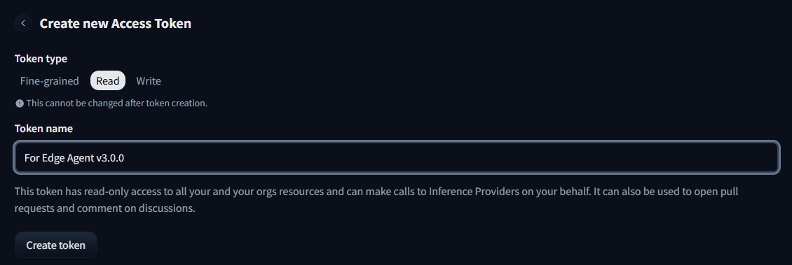
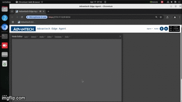

# Advantech Edge Agent

📢 **Edge Agent v3.0.0 is officially supporting Jetson Thor now!**

**If you are using MIC-733 with Jetpack 6.0, please change the version by switching to the [tag v2.0.0](https://github.com/advantech-EdgeAI/Edge_Agent/tree/v2.0.0).**

Advantech Edge Agent is an interactive sandbox designed to facilitate the rapid design and experimentation of automation agents, personal assistants, and edge AI systems. It seamlessly integrates multimodal Large Language Models (LLMs), speech and vision transformers, vector databases, prompt templates, and function calling with live sensors and I/O. Optimized for deployment on Jetson devices, it offers on-device computing, low-latency streaming, and unified memory for enhanced performance.

<a href="https://youtu.be/bKSFZuh24Yc"></a>

## Key Features

- **Interactive Environment**: Design and test automation agents and personal assistants in a user-friendly interface.
- **Multimodal Integration**: Combine LLMs with speech and vision transformers for comprehensive AI solutions.
- **Real-Time Sensor Integration**: Connect and interact with live sensors and I/O for real-world applications.
- **Optimized for Jetson Devices**: Leverage on-device computing and low-latency streaming for enhanced performance.

> 💡Learn more about [Preset Projects](https://github.com/advantech-EdgeAI/edge_agent/wiki/03-preset-projects) of using Edge Agent in wiki.

> 💡Watch a quick intro video [here](https://www.youtube.com/watch?v=P6T5xecStjk).

## System Architecture

Advantech Edge Agent is built on Agent Studio from Jetson AI Lab, enhanced with additional custom features. Users may find the [official tutorial](https://www.jetson-ai-lab.com/archive/agent_studio.html), the [Jetson Forums](https://forums.developer.nvidia.com/c/agx-autonomous-machines/jetson-embedded-systems/jetson-projects/78) and [GitHub Issues](https://github.com/dusty-nv/NanoLLM) from NVIDIA helpful.

## Installation Guide

### System Requirements

| Name            | Description                                           |
|-----------------|-------------------------------------------------------|
| Product         | MIC-742-AT / MIC-743-AT           |
| JetPack Version | V7.0         |
| Storage         | Pre-installed 1TB SSD (no extra SSD is needed)   |
| USB Camera      | Logitech c270 HD webcam or any V4L2 compatible camera |
| Internet        | Required during installation                          |

### 1. Clone this Repository

Clone this repository to your JetPack 7 device:

```sh
git clone https://github.com/advantech-EdgeAI/edge_agent.git
cd edge_agent
```

### 2. Docker Service Installation

Check the Docker version to ensure that the Docker service is installed and running properly on your system:

```bash
docker --version
```

If Docker is not available, follow [the guide](https://github.com/advantech-EdgeAI/VSS/issues/2) to install Docker.

###  3. Pull the Docker Image

The image is ~135 GB. Ensure your SSD has sufficient free space before pulling.

```bash
docker pull ispsae/nano_llm:jp7-universal
docker tag  ispsae/nano_llm:jp7-universal edge_agent:v2-vllm
docker rmi ispsae/nano_llm:jp7-universal
```

### 4. Extract the Data Package

The data package contains pre-compiled AI models, TensorRT caches, demo videos, and datasets (~28 GB).

```bash
mkdir -p data nanoowl/data
docker run --rm \
  -v $(pwd)/data:/data \
  -v $(pwd)/nanoowl/data:/nanoowl_data \
  ispsae/edge_agent_data:jp7
```

After extraction, your project structure will look like:

```
edge_agent/
├── data/
│   ├── models/
│   │   ├── mlc/dist/      ← pre-compiled MLC LLM models
│   │   ├── clip/          ← TensorRT vision tower cache
│   │   ├── whisper/       ← Whisper speech models
│   │   └── piper/         ← Piper TTS voices
│   ├── nanodb/            ← vector database for RAG demos
│   ├── videos/demo/       ← demo video files
│   └── ...
├── nanoowl/data/
│   └── owlv2.engine       ← OWL-ViT TensorRT engine
├── start.sh
└── .env
```

### 5. Configure Hugging Face Access Token

Please go to Hugging Face official website to [generate your personal access token](https://huggingface.co/settings/tokens) for pulling models from Hugging Face. You will only need to generate the one with ***read*** permission.



Copy `.env` file:

```bash
cp .env.example .env
```

Edit `.env` and set your token:

```bash
HUGGINGFACE_TOKEN=hf_xxxxxxxxxxxxxxxxxxxxxxxxxxxxxxxx
```

Please keep your token safely. Do not share it with others.

## Usage / Quick Start

### 1. Start Edge Agent

Start the Edge Agent, and the backend will listen on port 8050 on localhost:

```bash
bash start.sh
```

After ~20 seconds, open a browser and go to:

```
https://<YOUR_DEVICE_IP>:8050
```

### 2. Check the Log

```bash
docker logs -f edge_agent_run
```

### 3. Start a Quick Demo Project

Load a preset project for a quick demo. Click to learn more.

<a href="https://www.youtube.com/watch?v=XNr-aNQwoPc"></a>

### 4. Stop Edge Agent

```bash
docker stop edge_agent_run
```

## Troubleshooting

We maintain frequently asked questions as GitHub Issues. This allows for better tracking, discussions, and updates.

How to Find Answers:
- Check the [FAQ label](https://github.com/advantech-EdgeAI/edge_agent/issues?q=is%3Aissue%20state%3Aclosed%20label%3AFAQ) in Issues to see if your question has already been answered.
- Use the search bar in the Issues tab to find relevant discussions.
- If you can’t find what you need, feel free to open a new issue with your question!

Looking for tech support or have a business inquiry? Let’s talk: [Contact Form](https://www.advantech.com/en/form/2bcb7004-44e9-4e70-9ef0-520f326e6141?callback=f51f1493-33ae-43e5-8172-cb8055499ec1)
