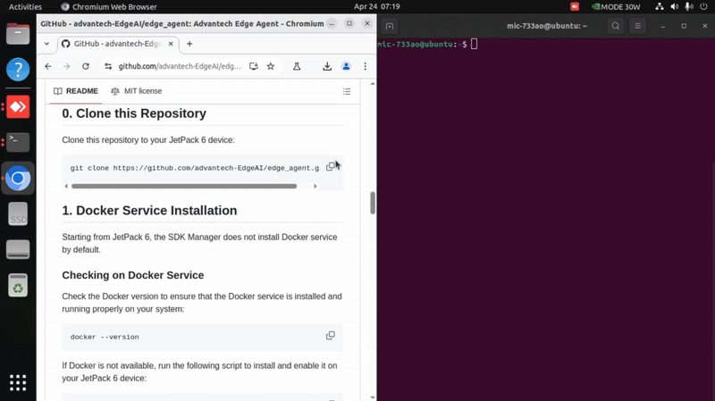
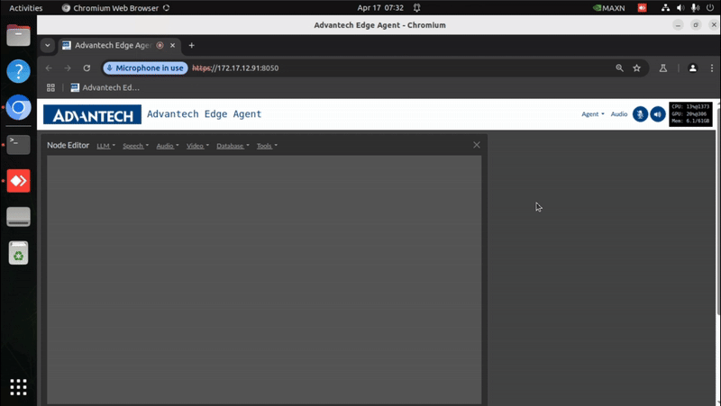

# Advantech Edge Agent

Advantech Edge Agent is an interactive sandbox designed to facilitate the rapid design and experimentation of automation agents, personal assistants, and edge AI systems. It seamlessly integrates multimodal Large Language Models (LLMs), speech and vision transformers, vector databases, prompt templates, and function calling with live sensors and I/O. Optimized for deployment on Jetson devices, it offers on-device computing, low-latency streaming, and unified memory for enhanced performance.

<a href="https://www.youtube.com/watch?v=xsvGXlDslf0"></a>

> 💡Advantech Edge Agent is built on Agent Studio from Jetson AI Lab, enhanced with additional custom features. Users may find the [official tutorial](https://www.jetson-ai-lab.com/tutorial-intro.html), the [Jetson Forums](https://forums.developer.nvidia.com/c/agx-autonomous-machines/jetson-embedded-systems/jetson-projects/78) and [GitHub Issues](https://github.com/dusty-nv/NanoLLM) from NVIDIA helpful.

## Features

- **Interactive Environment**: Design and test automation agents and personal assistants in a user-friendly interface.
- **Multimodal Integration**: Combine LLMs with speech and vision transformers for comprehensive AI solutions.
- **Real-Time Sensor Integration**: Connect and interact with live sensors and I/O for real-world applications.
- **Optimized for Jetson Devices**: Leverage on-device computing and low-latency streaming for enhanced performance.

> 💡Learn more about [Preset Projects](https://github.com/advantech-EdgeAI/edge_agent/wiki/03-preset-projects) of using Edge Agent in wiki.

> 💡Watch a quick intro video [here](https://www.youtube.com/watch?v=P6T5xecStjk).

# Edge Agent Installation 

## System Requirements

| Name            | Description                                           |
|-----------------|-------------------------------------------------------|
| Product         | MIC-733-AO5A1 (32GB) / MIC-733-AO6A1 (64GB)           |
| JetPack Version | ⚠️ V6.0GA (***ONLY Verified on JetPack6.0***)         |
| Storage         | 512GB NVMe SSD (recommended)                          |
| USB Camera      | Logitech c270 HD webcam or any V4L2 compatible camera |
| Internet        | Required during installation                          |

## Short Video Installation Guide

Our short video tutorial walks you through the steps for installation and configuration. Click it to learn more.

<a href="https://www.youtube.com/watch?v=zIH040_c2yg"></a>

## 0. Clone this Repository

Clone this repository to your JetPack 6 device:

```sh
git clone https://github.com/advantech-EdgeAI/edge_agent.git
```

## 1. Docker Service Installation 
Starting from JetPack 6, the SDK Manager does not install Docker service by default.

### Checking on Docker Service
Check the Docker version to ensure that the Docker service is installed and running properly on your system:

```bash
docker --version
```

If Docker is not available, run the following script to install and enable it on your JetPack 6 device:

```bash
bash init-dockerd-jetson-jp6.sh
```

##  2. (Optional) Setup Extended Storage - NVMe SSD
🔔 *If your root filesystem (`/`) has more than 200 GB of free storage, you can skip this step and proceed to the 'Download Essential Data' section.*

⚠️ [Why does my Advantech device boot into emergency mode, and how can I fix it?](https://github.com/advantech-EdgeAI/edge_agent/issues/8)

### Physical Installation
1. Power off your Jetson device and disconnect peripherals.
2. Insert the NVMe SSD into the carrier board, ensuring it's properly seated and secured.
3. Reconnect peripherals and power on the device.
4. Verify the SSD is recognized by running:

   ```bash
   lspci
   ```

   You should see an entry similar to:
   ```
   0007:01:00.0 Non-Volatile memory controller: Marvell Technology Group Ltd. Device 1322 (rev 02)
   ```

### Create ext4 Filesystem on SSD and Mount it to `/ssd` by Default
 - Follow the 'Format and Set Up Auto-Mount' section in this [link](https://www.jetson-ai-lab.com/tips_ssd-docker.html#format-and-set-up-auto-mount).

### Migrate Docker Directory to SSD
 - Follow the 'Migrate Docker Directory SSD' section in this [link](https://www.jetson-ai-lab.com/tips_ssd-docker.html#migrate-docker-directory-to-ssd).


### Optional Setup Steps

 You can follow these ***optional*** steps to verify that the SSD is configured correctly for Docker images and disable Apport reporting:

- [Test Docker on SSD](https://github.com/advantech-EdgeAI/edge_agent/issues/5)
- [Disable Apport Reporting](https://github.com/advantech-EdgeAI/edge_agent/issues/6)

## 3. Download Essential Data

Run the following script to download Docker images and the necessary packages:

```bash
bash download-EA-JC-2ssd.sh
```

## 4. Start Edge Agent

Start the Edge Agent, and the backend will listen on port 8050 on localhost:

```bash
bash startEA.sh
```

## 5. Start Working on Edge Agent Through Web UI

Once the Edge Agent starts up successfully, open another terminal to launch the web browser (Chromium):

```bash
bash launch-chromium.sh
```

At this stage, you should have successfully started the Edge Agent and accessed it via Chromium.

## 6. Start a Quick Demo Project

Load a preset project for a quick demo. Click to learn more.

<a href="https://www.youtube.com/watch?v=XNr-aNQwoPc"></a>

## 7. Field Cases 

<a href="https://youtu.be/bKSFZuh24Yc">Click</a> to check out the six scenarios of customized, high-efficiency AI deployment that help clients Build Smarter & Faster.

<a href="https://youtu.be/bKSFZuh24Yc"></a>

## FAQ

We maintain frequently asked questions as GitHub Issues. This allows for better tracking, discussions, and updates.

How to Find Answers:
- Check the [FAQ label](https://github.com/advantech-EdgeAI/edge_agent/issues?q=is%3Aissue%20state%3Aclosed%20label%3AFAQ) in Issues to see if your question has already been answered.
- Use the search bar in the Issues tab to find relevant discussions.
- If you can’t find what you need, feel free to open a new issue with your question!

Looking for tech support or have a business inquiry? Let’s talk: [Contact Form](https://www.advantech.com/en/form/2bcb7004-44e9-4e70-9ef0-520f326e6141?callback=f51f1493-33ae-43e5-8172-cb8055499ec1)
